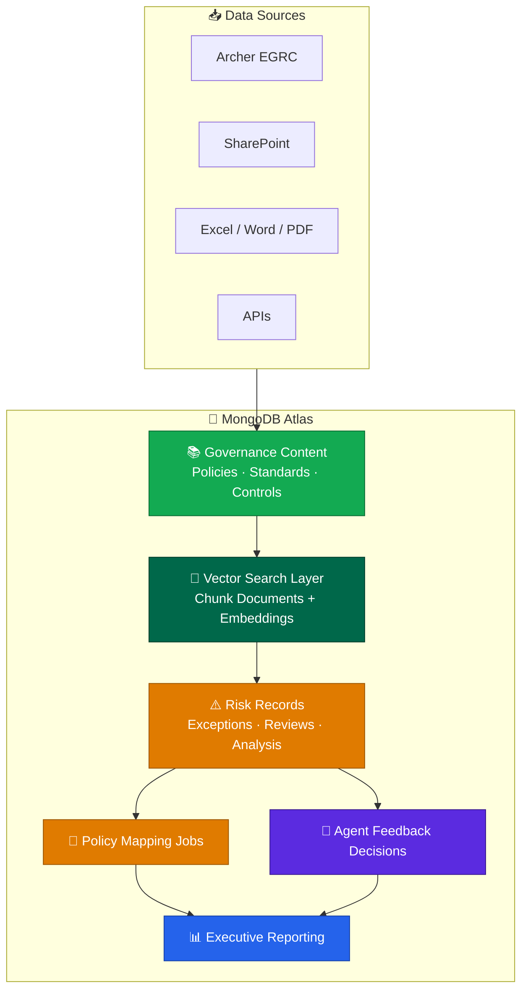
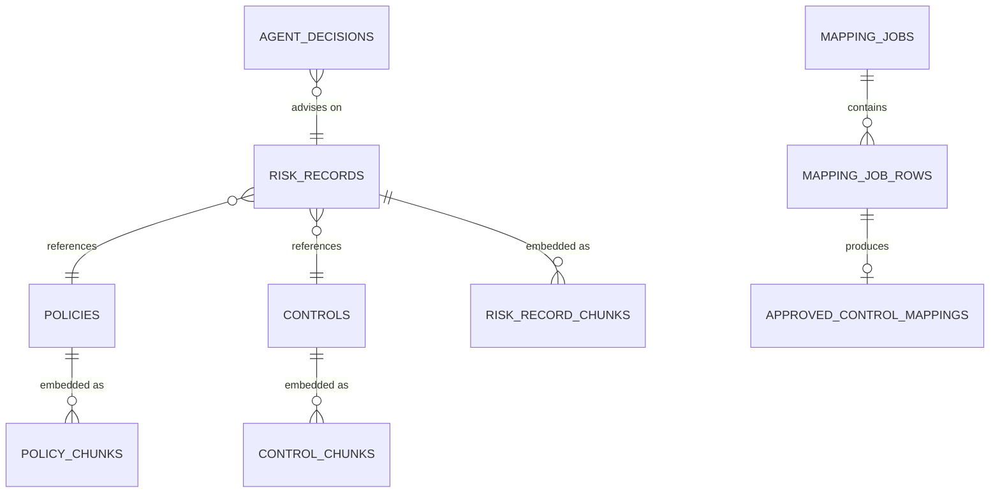

<div align="center">

# 🛡️ GRC Assistant

**An AI-native Governance, Risk & Compliance knowledge platform built on MongoDB Atlas.**

[](#-status)
[](https://www.mongodb.com/atlas)
[](https://www.mongodb.com/products/platform/atlas-vector-search)
[](https://www.voyageai.com/)

</div>

GRC Assistant extracts and centralizes governance, risk, and compliance data from **Archer (EGRC)** and other sources (Excel, shared folders, Word docs) into a **queryable, AI-ready knowledge base**, redesigning a traditional PostgreSQL GRC application as a flexible MongoDB document model.

---

## 🏗️ Architecture



---

## 🎯 Objectives

| Goal | Why it matters |
| --- | --- |
| Replace normalized tables with business aggregates | Fewer joins, faster reads |
| Support evolving policy schemas without migrations | Flexible document model |
| Store structured + unstructured data together | One platform, no ETL sprawl |
| Enable semantic search across governance content | Powered by Atlas Vector Search |
| Serve operational + AI retrieval from one database | Lower cost, simpler ops |

---

## 🔄 Source → Target Migration

The legacy relational model is grouped by color: 🟨 **raw data**, 🟩 **derived data**, 🟧 **log tables**. Each source table maps to a MongoDB collection (embedded, referenced, or chunked).

| Legacy Table | Kind | Target MongoDB Collection | Strategy |
| --- | --- | --- | --- |
| `ARCHER` | 🟨 raw | `policies` | Aggregate root + versioning |
| `DOCUMENTS` | 🟨 raw | `policies.attachments` + `policy_chunks` | Embed metadata, chunk body |
| `CONTROL_STANDARD` | 🟨 raw | `control_standards`, `controls` | Reference + chunk |
| `STANDARD` | 🟨 raw | `security_standards`, `standard_chunks` | Reference + chunk |
| `RISKRECORD` | 🟨 raw | `risk_records` | Aggregate root |
| `VULNERABILITY_TYPE` | 🟨 raw | `risk_records.typeDetails` | Embed |
| `FIREWALL_TYPE` | 🟨 raw | `risk_records.typeDetails` | Embed |
| `RISK_ANALYSIS` | 🟩 derived | `risk_record_chunks` + `agent_decisions` | Chunk + embed embeddings |
| `RISK_GROUPING` | 🟩 derived | `risk_records.classification` | Embed |
| `APPROVED_CONTROL_MAPPINGS` | 🟩 derived | `approved_control_mappings` | Reference |
| `JOBS` / `JOB_ROWS` | 🟨 raw | `mapping_jobs`, `mapping_job_rows` | Job + line items |
| `CHANGE_LOG` | 🟧 log | `risk_records.auditLog` | Embed array |
| `RISK_RULES_LOG` | 🟧 log | `risk_records.auditLog` | Embed array |

> **Versioning note (from the source diagram):** policy version lives at the *end of the name* (e.g. `Policy 111`), `Security Standards 111.1.1` may not yet exist in the system, and `Control Standard 111.1.01` (imported record level) does carry a version. The target model promotes this to a first-class `version` field on every governance document.

---

## 📦 Collection Model



| Group | Collections |
| --- | --- |
| 📚 **Governance** | `policies`, `security_standards`, `control_standards`, `controls` |
| 🔎 **Vector Search** | `policy_chunks`, `standard_chunks`, `control_chunks`, `risk_record_chunks` |
| ⚠️ **Operational** | `risk_records` |
| 🔧 **Mapping Workflow** | `mapping_jobs`, `mapping_job_rows`, `approved_control_mappings` |
| 🤖 **Agent Feedback** | `agent_decisions` |
| 🗂️ **Metadata** | `sources` |

---

## 📄 Sample Documents

### `policies`

```json
{
  "_id": "POL-1042",
  "title": "Data Encryption at Rest",
  "version": 4,
  "status": "active",
  "effectiveDate": "2026-01-01",
  "retiredDate": null,
  "owner": { "team": "Security Engineering", "contact": "ciso@example.com" },
  "tags": ["encryption", "data-protection", "nist-800-53"],
  "body": "All production data stores must encrypt data at rest using AES-256..."
}
```

### `policy_chunks` (one embedding per semantic chunk)

```json
{
  "_id": "POL-1042#c03",
  "policyId": "POL-1042",
  "version": 4,
  "text": "All production data stores must encrypt data at rest using AES-256.",
  "metadata": { "section": "3.1", "tags": ["encryption"] },
  "embedding": [0.0123, -0.0456, 0.0789, "...1024 dims..."]
}
```

### `risk_records` (aggregate with embedded audit log)

```json
{
  "_id": "RISK-7781",
  "title": "Unencrypted backup bucket",
  "classification": { "severity": "high", "likelihood": "medium" },
  "typeDetails": { "type": "data-exposure", "asset": "s3://backups-prod" },
  "policyRefs": ["POL-1042"],
  "controlRefs": ["CTL-220"],
  "auditLog": [
    { "ts": "2026-06-20T14:00:00Z", "actor": "scanner", "action": "created" },
    { "ts": "2026-06-21T09:12:00Z", "actor": "j.schmitz", "action": "reviewed" }
  ]
}
```

---

## 🔎 Atlas Vector Search Index

```json
{
  "fields": [
    {
      "type": "vector",
      "path": "embedding",
      "numDimensions": 1024,
      "similarity": "cosine"
    },
    { "type": "filter", "path": "policyId" },
    { "type": "filter", "path": "version" }
  ]
}
```

---

## 🧪 Query Examples

**Semantic search over policy chunks (version-aware):**

```javascript
db.policy_chunks.aggregate([
  {
    $vectorSearch: {
      index: "policy_vector_index",
      path: "embedding",
      queryVector: queryEmbedding,        // from Voyage AI
      numCandidates: 200,
      limit: 5,
      filter: { version: 4 }
    }
  },
  {
    $project: {
      text: 1,
      policyId: 1,
      score: { $meta: "vectorSearchScore" }
    }
  }
]);
```

**Join risk records back to their governing policies:**

```javascript
db.risk_records.aggregate([
  { $match: { "classification.severity": "high" } },
  {
    $lookup: {
      from: "policies",
      localField: "policyRefs",
      foreignField: "_id",
      as: "policies"
    }
  },
  { $project: { title: 1, "policies.title": 1, "policies.version": 1 } }
]);
```

---

## 🧠 Modeling Principles

```text
EMBED      →  read-together data:  riskAnalysis · auditLog · typeDetails
REFERENCE  →  shared content:      policies · standards · controls
CHUNK      →  one doc per chunk:   better recall · easy re-embedding · metadata filters
```

---

## ⚡ Why MongoDB?

> Traditional SQL optimizes **relationships**. MongoDB optimizes **business objects**.

Instead of dozens of joins, the application works directly with natural aggregates: **Risk Record · Policy · Standard · Control · Mapping Job · Agent Decision**, each optimized for both operational workloads and AI retrieval.

**Atlas features used:** Vector Search · Hybrid Search · compound metadata filtering · flexible document model · native JSON · horizontal scaling · Atlas Search · version-aware filtering · Change Streams (future).

---

## 🗺️ Roadmap

- [ ] Final MongoDB document model
- [ ] Collection design
- [ ] Sample JSON documents
- [ ] Index strategy
- [ ] Atlas Vector Search indexes
- [ ] Chunking strategy
- [ ] Embedding workflow
- [ ] Voyage AI integration
- [ ] Query examples
- [ ] Aggregation pipelines
- [ ] Architecture diagrams
- [ ] POC implementation

---

## 🚧 Status

**Work in progress.** This repository documents the design and implementation of an AI-native GRC platform on MongoDB Atlas, replacing a traditional relational model with a flexible document architecture optimized for semantic search, operational workloads, and agentic AI.
